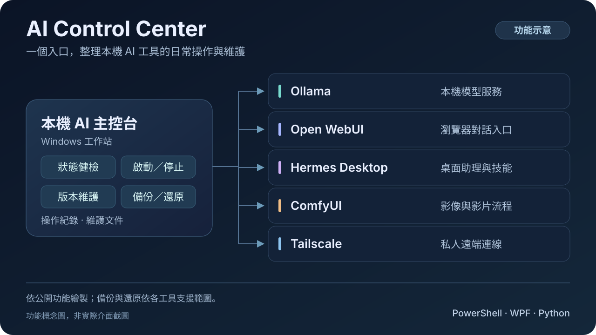
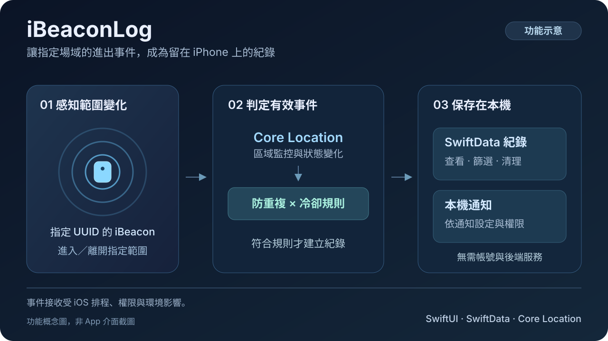

# Elton Chung

**Senior IT Manager · System Development & Integration · Software Engineering**

持續參與軟體開發的 IT Manager，現居台灣。工作重心是系統開發與整合、軟體工程及團隊與專案管理，領域涵蓋 FinTech／Payment、Cloud 與資訊安全。

工作之外，我也開發個人工具、iOS App 與遊戲，並將 AI-assisted Development 用在實作與迭代中。最近持續探索 AI Agents 與 Automation，關注如何讓這些工具融入實際的開發流程。

## Background & interests

- System Development & Integration
- Software Engineering · Engineering & Project Management
- FinTech / Payment · Cloud · Information Security
- AI-assisted Development · AI Agents · Automation
- PMP · ISO 27001

## Featured projects

### [Slow Journey（WJ）— 旅行探索遊戲](https://github.com/eltonchung/slow-journey-showcase)

以散步、攝影與旅行手帳為核心的原生 iOS 遊戲。在山城、海港與森林中交談、觀察與拍照，讓自己的照片參與故事，也留下可以回看的旅程紀錄。目前前三章已接入可玩流程，整體仍持續開發中。

工程重點包括攝影與任務共用證據規則、跨章照片與進度保存，以及避免非同步寫入覆蓋新資料。公開 repository 提供作品畫面、功能與技術設計說明，完整原始碼保留私有。

Swift · SpriteKit · SwiftUI · iOS

[功能介紹](https://github.com/eltonchung/slow-journey-showcase/blob/main/FEATURES.md) · [技術架構](https://github.com/eltonchung/slow-journey-showcase/blob/main/ARCHITECTURE.md) · [畫面展示](https://github.com/eltonchung/slow-journey-showcase/blob/main/GALLERY.md) · [驗證範圍](https://github.com/eltonchung/slow-journey-showcase/blob/main/QUALITY.md)

### [雀山奇譚 — Taiwan Mahjong](https://github.com/eltonchung/TaiwanMahjong-Showcase)

以 Swift／SwiftUI 開發的單機台灣十六張麻將 iOS App，結合賽事內技能成長、玩家可決定結果的突發事件、具不同打法的 AI 牌友與牌譜回顧。

工程重點包括規則與畫面分離、可取消的背景手牌分析，以及局末保存與資料復原。公開 repository 提供產品與技術展示，完整原始碼保留私有。

Swift · SwiftUI · iOS · Game Development

[功能介紹](https://github.com/eltonchung/TaiwanMahjong-Showcase/blob/main/FEATURES.md) · [技術架構](https://github.com/eltonchung/TaiwanMahjong-Showcase/blob/main/ARCHITECTURE.md) · [畫面與影片](https://github.com/eltonchung/TaiwanMahjong-Showcase/blob/main/GALLERY.md) · [驗證範圍](https://github.com/eltonchung/TaiwanMahjong-Showcase/blob/main/QUALITY.md)

### [AI Control Center — 本機 AI 工具管理](https://github.com/eltonchung/ai-control-center)

Windows 桌面工具，集中查看 Ollama、Open WebUI、Hermes Desktop、ComfyUI 與 Tailscale 的狀態，並依各工具的支援範圍提供啟停、版本檢查、更新及備份復原流程。

PowerShell 5.1 · WPF · Python 3.11

公開 repository 提供原始碼、部署與操作文件。

### [Boardmarks — 書籤工作台](https://github.com/eltonchung/boardmarks)

以 Chrome 原生書籤為基礎的新分頁擴充功能，將工作空間、分類收藏與開啟中的分頁放在同一個畫面。支援拖曳收藏、整個視窗保存、全域搜尋及 Toby 匯入，讓整理好的資料能在下次工作時接著使用。

React · TypeScript · Vite · Chrome Manifest V3

專案內提供介面截圖、安裝指南、架構說明與測試文件。

### [iBeaconLog — iBeacon 進出紀錄工具](https://github.com/eltonchung/BeaconLogger-Showcase)

依指定 iBeacon 範圍變化建立進出紀錄的 iOS App，整合本機儲存、通知、冷卻與防重複機制，並提供 Beacon 命名、訊號診斷及資料管理功能。

Swift 6 · SwiftUI · SwiftData · Core Location · UserNotifications

公開 repository 提供功能與技術設計說明，完整原始碼保留私有。
